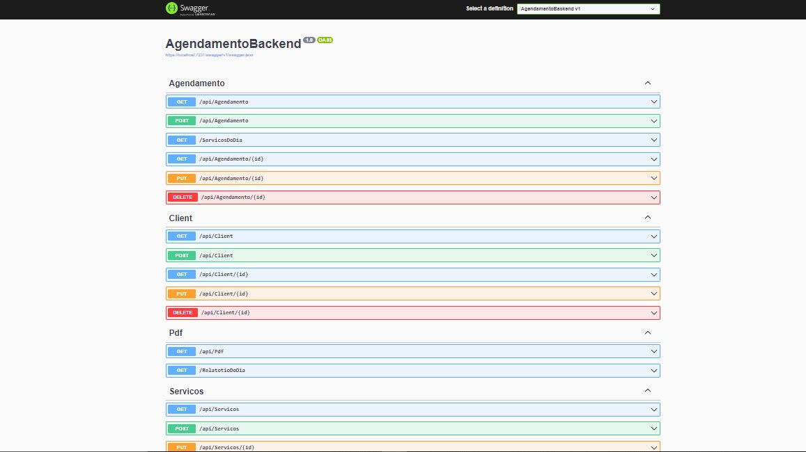
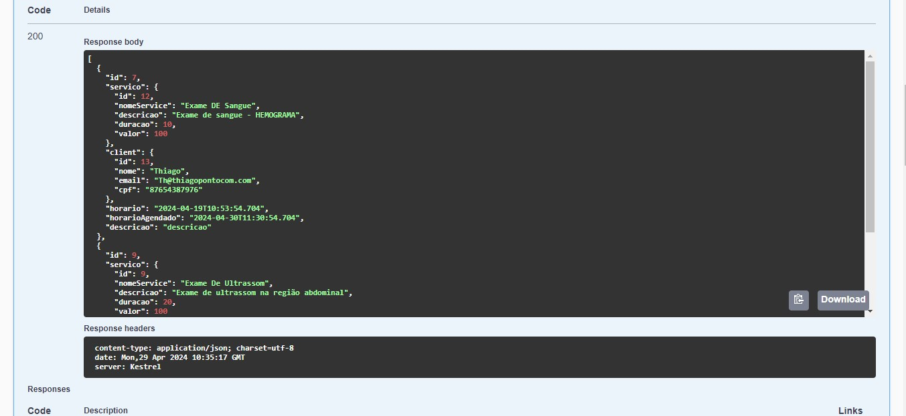
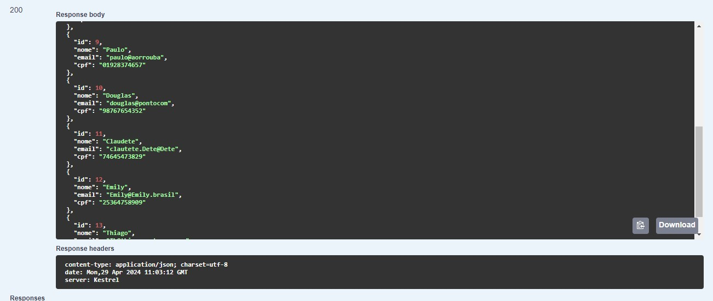
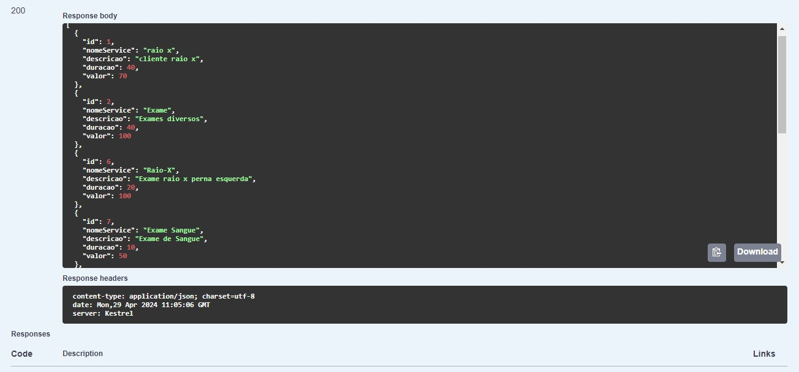

## Backend Agendamento De Serviços 👨🏼‍💻

- 📌 O projeto, propõe o cliente usar e adaptar o  projeto para o seu nicho em especifo como por exemplo: Clinicas, Barbearias e etc...
- 👉🏼 O projeto é um CRUD e permite realizar as 4 operações(**Criar, Ler, Atualizar e Excluir**) em todas classes ( **Agendamento**, **Cliente** e **Serviços**) 



 ## Como funciona ?
- 🌎 Este projeto é um sistema de backend desenvolvido para gerenciar o agendamento de serviços. Ele fornece uma API onde permite que os clientes agendem serviços e os provedores de serviço gerenciem seus horários disponíveis e compromissos.

O projeto possui **3 Classes**: **Agendamento**, **Cliente** e **Serviços**. (Também tem a classe PDF Porém **ainda esta em desenvolvimento**).

## Exemplos De Funcionalidade: 👨🏼‍💻
- **Cadastro De Agendamento:** Ao cadastrar um Agendamento, consequentemente está cadastrando um novo servico e também um cliente paralelamente. Ao Executar o método **GET** Da Classe **Agendamento** Obtemos esse resultado:



- Ao cadastrar o Agendamento pelo método PUT, automaticamente ela cadastra os clentes agendados e os serviços nas respectivas classes;

  **Exemplo a Classe Cliente:**

  


   **Exemplo a Classe Serviço:**

  

  
## Funcionalidades Principais

 - **Agendamento de Serviços:** Os clientes podem agendar serviços disponíveis.
 - **Gerenciamento de Horários:** Os provedores de serviço podem definir seus horários de disponibilidade.
 - **Administração do Sistema:** Área administrativa para gerenciar usuários, serviços e horários.


## Tecnologias Utilizadas
- **Linguagem de Programação:** C#
- **Framework Web:** ASP .NET Core
- **Banco de Dados:** MySQL

## Instalação e Configuração

- **Clone o repositório:**
 ``` bash
   git clone https://github.com/DanielCamargo1/AgendamentoBackend.git
  ```
- **Instale Os Nuget´s No Visual Stúdio**
   - Microsoft.EntityFrameWorkCore;
   - Microsoft.EntityFrameWorkCore.Design;
   - Microsoft.EntityFrameWorkCore.Tools;
   - Pomelo.EntityFrameWorkCore.MySql;
   - AutoMapper.Extensions.Microsoft.DependencyInjecion;
 
     Agora é só rodar o projeto e testar as funcionalidades 😉
